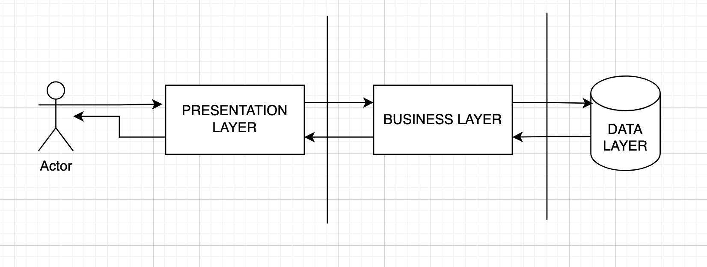
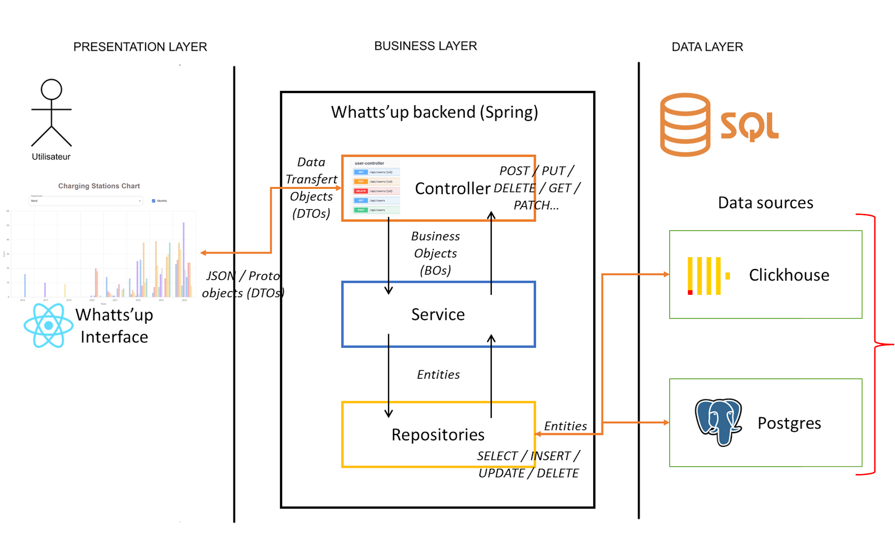

# 🚀 Whatts'up - Architecture et Conception

## 📝 Introduction

Whatts'up est une application permettant de gérer et d'afficher des informations sur les stations de recharge électrique en France.

<p align="center">
      
</p>
<p align="center">
      <i>
         Ce schéma permet une représentation imagée de ce projet. Un autre schéma plus bas et plus détaillé permet de mieux comprendre les échanges qui ont lieu.
      </i>
</p>

Ce projet suit une architecture **N-tier** basée sur **Spring Boot** pour le backend et **React** pour le frontend, tout en utilisant **PostgreSQL** et **Clickhouse** comme bases de données.  
Les échanges entre le frontend et le backend se font via des objets **DTO** et des **protocoles Protobuf**.

---

## 🏗️ Architecture du Projet

### 📌 Schéma complet de l'Architecture

<p align="center">
  
</p>

### 🛠️ Présentation de l'Architecture

L'architecture de Whatts'up est divisée en **trois couches principales** :

1. 🎨 **Presentation Layer (Interface utilisateur - React)**
   - 📊 Affiche les données des stations sous forme de graphiques et de listes.
   - 🔄 Envoie des requêtes API au backend en **JSON** ou **plain text** et réceptionne des données **JSON** ou **Protobuf**.
2. ⚙️ **Business Layer (Backend - Spring Boot)**

   - 🏢 Contient la **logique métier**.
   - 📡 Expose une API **REST** pour gérer les stations de recharge et les utilisateurs.
   - 🔗 Utilise des **DTOs** et **Protobuf** pour transférer les données entre le backend et le frontend.

3. 🗄️ **Data Layer (Bases de données - PostgreSQL & Clickhouse)**
   - 🛢️ **PostgreSQL** : Stocke les **utilisateurs** et les **informations statiques** des stations de recharge.
   - 📈 **Clickhouse** : Gère les **données analytiques** sur l'utilisation des stations.

---

## 🗃️ Détails des Bases de Données

Nous utilisons ici deux sources de données bien distinctes car nous avons deux besoins différents, mais il faut imaginer qu'il pourrait en avoir beaucoup plus ! Notre _backend_ est donc chargé, en fonction de la demande du _front_, de sélectionner la source de données la plus appropriée en fonction des besoins.

### 🛢️ PostgreSQL

- **👤 Users** : Stocke les informations des utilisateurs pour la connexion (**Basic Auth**).
- **⚡ ChargingStations** : Contient les informations statiques des stations de recharge (**nom, adresse, opérateur, etc.**).

### 📊 Clickhouse

- Stocke les **données analytiques** des stations de recharge pour permettre des requêtes rapides et efficaces sur l'utilisation des stations.
- Permet une **analyse historique** de l'utilisation des stations (utile pour effectuer des analyses de données poussées sur un dataset de grand volume comme celui-ci).

---

## ⚡ Détails de l'API Spring Boot

L’API est construite autour de plusieurs concepts clés :

### 🔄 DTOs (**Data Transfer Objects**)

- 📤 Servent à **transférer des données** entre le frontend et le backend de manière **optimisée**.
- 🛑 **Encapsulent les données** sans exposer directement les **entités du modèle de données**.

### 📦 BOs (**Business Objects**)

- 🔍 Utilisés dans la **couche service** pour appliquer la **logique métier**.
- 🔄 Transformés en **DTOs** avant d’être envoyés au frontend.

### 🏛️ Entités

- 📜 Correspondent directement aux **tables de la base de données** et sont manipulées par les **repositories Spring Data**.

### ⚡ Protos (**Protocol Buffers**)

- 🏎️ Utilisés pour **sérialiser et désérialiser** les données de manière **efficace** entre le backend et le frontend.
- ⚡ **Améliorent les performances** comparés au JSON.

---

## 🔗 Routes API

L’API expose plusieurs routes pour gérer les **utilisateurs** et les **stations de recharge** :

### 👤 Gestion des utilisateurs (**Basic Auth**)

- 🆕 `POST /api/users` : **Création** d’un utilisateur.
- 🔍 `GET /api/users/{id}` : **Récupération** d’un utilisateur par ID.
- 🔍 `GET /api/users/` : **Récupération** d’une liste d'utilisateurs (données protobuf car lourd) en utilisant la pagination.
- 🔄 `PUT /api/users/{id}` : **Mise à jour** d’un utilisateur.
- ❌ `DELETE /api/users/{id}` : **Suppression** d’un utilisateur.

### ⚡ Gestion des stations de recharge

- 🆕 `POST /api/stations` : **Ajout** d’une nouvelle station.
- 🔍 `GET /api/stations/{id}` : **Récupération** des détails d’une station.
- 📋 `GET /api/stations` : **Récupération** de toutes les stations (données protobuf car lourd) en utilisant la pagination.
- 📋 `GET /api/stations/quantities` : **Récupération** des données d'ajout et quantités de station ajoutées dans le temps (la granularité peut être ajustée en mois / années / départements). Cette route effectue une requête lourde et importante dans **Clickhouse** et réalise des traitements de données analytiques.
- 🔄 `PUT /api/stations/{id}` : **Mise à jour** des informations d’une station.
- ❌ `DELETE /api/stations/{id}` : **Suppression** d’une station.

### ⚡ Gestion de l'authentification

- 🆕 `POST /api/auth/login` : **Connexion** à l'application avec un couple identifiant / mot de passe (authentification basique).
- 🆕 `POST /api/auth/logout` : **Déconnexion** de l'application (pour le moment ne fait rien mais on peut imaginer qu'avec un autre système d'authentification qu'une basic auth, une telle route pourra être nécessaire).

---

## Acheminement d’une requête utilisateur 📡

Prenons l'exemple d'un utilisateur affichant un **histogramme des stations de recharge** dans le temps sur l'interface React. Voici comment sa requête est traitée à travers les différentes couches de l'application :

1. **Frontend (React) - Envoi de la requête** 🚀

L'utilisateur interagit avec l'interface (arrivée sur l'écran de l'histogramme par exemple), ce qui déclenche une requête envoyée en _JSON_ ou _Protobuf_ vers le _backend_ :

```http
GET /api/stations/quantities
```

2. **Controller (Spring Boot) - Réception et validation** 🎯

Le _ChargingStationController_ reçoit la requête et vérifie les paramètres.
Il l'envoie ensuite à la couche service.

3. **Service - Logique métier et transformation** 🏗️

Le _ChargingStationService_ exécute la logique métier (on peut imaginer qu'il y en a une).
Il interroge le _ChargingStationRepository_ pour récupérer les données depuis _Clickhouse_.

4. **Repository - Accès aux données analytiques** 🗄️

Le _ChargingStationRepository_ exécute une requête _Clickhouse_ optimisée pour récupérer les statistiques d'utilisation des stations.
Les données sont renvoyées sous forme d'entités (_entities_).

5. **Transformation et Sérialisation en Protobuf** 🔄

Le Service transforme les entités en _BOs_ afin d'effectuer des actions dessus si nécessaires, puis en _DTOs_.
Ces _DTOs_ sont ensuite sérialisés en _Protobuf_ avant d’être envoyés au _frontend_ par le controlleur.

6. **Retour au Frontend et Affichage** 📊

Le _frontend_ reçoit les données sous forme de _Protobuf_, les désérialise et met à jour l’histogramme.
L’utilisateur voit l'évolution des stations de recharge en fonction du temps ! 🚗⚡

## 🤔 Choix de Conception

### 🛢️ Pourquoi PostgreSQL et Clickhouse ?

- **PostgreSQL** 📜 pour stocker les informations **structurées** et **relationnelles**.
- **Clickhouse** ⚡ pour **analyser rapidement** de grandes quantités de données sur l'utilisation des stations.

### 📡 Pourquoi utiliser Protobuf ?

- 🚀 **Sérialisation plus performante** que JSON.
- 📉 **Réduction de la taille** des messages échangés entre le frontend et le backend.

### 🏗️ Pourquoi une architecture en couches ?

- 🎯 **Séparation claire** des responsabilités (**Présentation, Métier, Données**).
- 🛠️ **Facilité de maintenance** et **d'évolution** du projet.

---

## ✅ Conclusion

Ce projet suit une approche **modulaire** et **optimisée** pour la gestion des stations de recharge électrique.  
Grâce à une séparation claire entre les différentes couches et l'utilisation de **technologies adaptées** (_Spring Boot, React, PostgreSQL, Clickhouse, Protobuf_), il permet une **gestion efficace des données** et une **bonne expérience utilisateur**. 🚀
